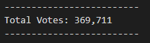
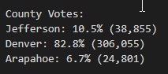
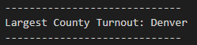
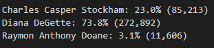
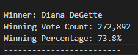

# Election_Analysis

## Overview of the Election Audit

### A Colorado Board of Elections employee has requested an election audit of a recent congressional election. The election results were from 3 counties and 3 candidates with more than 379,000 votes recorded.

## Election Audit Results

- Total vote count 

     
- County level votes count and percentages

         
- Largest turnout

        
- Candidate level vote count and percentages

        
- Final election results

        

### Code analysis
####
- Total vote count was obtained by reading every row in the election_data.csv file. The total_votes counter was initialized to 0 and then updated as each new row was looped through (skipping the header row).
```python
# Initialize a total vote counter.
total_votes = 0
.
.
.
with open(file_to_load) as election_data:
    reader = csv.reader(election_data)

    # Read the header
    header = next(reader)

    # For each row in the CSV file.
    for row in reader:

        # Add to the total vote count
        total_votes = total_votes + 1
```
####
- County level votes count were collected in a dictionary. The totals were summed over the distinct county names. Within each county the percentage of the total votes was calculated.
```python
# 1: Create a county list and county votes dictionary.
county_options = []
county_votes = {}

    # For each row in the CSV file.
    for row in reader:

        # 3: Extract the county name from each row.
        county_name = row[1]

        # 4a: Write an if statement that checks that the
        # county does not match any existing county in the county list.
        if county_name not in county_options:

            # 4b: Add the existing county to the list of counties.
            county_options.append(county_name)

            # 4c: Begin tracking the county's vote count.
            county_votes[county_name] = 0

        # 5: Add a vote to that county's vote count.
        county_votes[county_name] += 1
.
.
.
    # 6a: Write a for loop to get the county from the county dictionary.
    for county_name in county_votes:

        # 6b: Retrieve the county vote count.
        cvotes = county_votes.get(county_name)

        # 6c: Calculate the percentage of votes for the county.
        cvote_percentage = float(cvotes) / float(total_votes) * 100
```
- Largest turnout was obtained from the county level percentages. The winning county was initialized to an empty string. The winning turnout and county votes were initialized to zero. Winning county, votes and percentages were updated by comparing to the best results.

```python
# 2: Track the largest county and county voter turnout.
winning_county = ""
winning_turnout= 0
cwinning_percentage = 0

         # 6f: Write an if statement to determine the winning county and get its vote count.
        if (cvotes > winning_turnout) and (cvote_percentage > cwinning_percentage):
            winning_turnout = cvotes
            winning_county = county_name
            cwinning_percentage = cvote_percentage
```
- Candidate level vote count and percentages were calculated with the same syntax used as with county level results.

- Final election results were calculated as were the county level turnout results.

All results were printed to the terminal as well as saved in the election_analysis.txt file

## Election Audit Summary

####