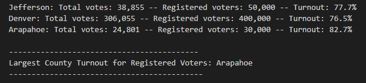

# PyPoll with Python

## Overview of the Election Audit

### A Colorado Board of Elections employee has requested an election audit of a recent congressional election. The election results were from three counties and three candidates with almost 379,000 votes recorded. The winner of the election as well as the county with the greatest voter turnout was collected.

## Election Audit Results

- Total vote count 

     
- County level votes count and percentages

         
- Largest turnout

        
- Candidate level vote count and percentages

        
- Final election results

        

### Code analysis
####
- Total vote count was obtained by reading every row in the election_data.csv file. The total_votes counter was initialized to 0 and then updated as each new row was looped through (skipping the header row).
```python
# Initialize a total vote counter.
total_votes = 0
.
.
.
with open(file_to_load) as election_data:
    reader = csv.reader(election_data)

    # Read the header
    header = next(reader)

    # For each row in the CSV file.
    for row in reader:

        # Add to the total vote count
        total_votes = total_votes + 1
```
####
- County level votes count were collected in a dictionary. The totals were summed over the distinct county names. Within each county the percentage of the total votes was calculated.
```python
# 1: Create a county list and county votes dictionary.
county_options = []
county_votes = {}

    # For each row in the CSV file.
    for row in reader:

        # 3: Extract the county name from each row.
        county_name = row[1]

        # 4a: Write an if statement that checks that the
        # county does not match any existing county in the county list.
        if county_name not in county_options:

            # 4b: Add the existing county to the list of counties.
            county_options.append(county_name)

            # 4c: Begin tracking the county's vote count.
            county_votes[county_name] = 0

        # 5: Add a vote to that county's vote count.
        county_votes[county_name] += 1
.
.
.
    # 6a: Write a for loop to get the county from the county dictionary.
    for county_name in county_votes:

        # 6b: Retrieve the county vote count.
        cvotes = county_votes.get(county_name)

        # 6c: Calculate the percentage of votes for the county.
        cvote_percentage = float(cvotes) / float(total_votes) * 100
```
- Largest turnout was obtained from the county level percentages. The winning county was initialized to an empty string. The winning turnout and county votes were initialized to zero. Winning county, votes and percentages were updated by comparing to the best results.

```python
# 2: Track the largest county and county voter turnout.
winning_county = ""
winning_turnout= 0
cwinning_percentage = 0

         # 6f: Write an if statement to determine the winning county and get its vote count.
        if (cvotes > winning_turnout) and (cvote_percentage > cwinning_percentage):
            winning_turnout = cvotes
            winning_county = county_name
            cwinning_percentage = cvote_percentage
```
- Candidate level vote count and percentages were calculated with the same syntax used as with county level results.

- Final election results were calculated as were the county level turnout results.

All results were printed to the terminal as well as saved in the election_analysis.txt file.

## Election Audit Summary

### These anlyses gave a nice summary of the three counties and candidates. Without any any adjustment to the code, a complete list of all counties and many more candidates could be perfomed. The layout of the csv file would be the same. It would then include rows with ballot IDs for more counties and candidates voted for in those counties. The printed and outputed code would have more rows of county level votes and percentages. The Turnout winner would be calculated and displayed in the same way. A new list of more candidates and their corresponding votes and percentages would be a longer table, but the winning candidate results would be in the same format. 
` `  
### There are opportunities to expand the code for future election audit needs. A column of party affiliation could be added to the CSV file if the Board of Elections wanted data on final results by party affiliation. Instead of county, the new list element would be party. It would be indexed with a 3 indicating its location in the new 4th column for party. The same syntax for winning candidate could be used to collect the unique party names and calculate the total votes and percentages. I added a new column to the csv file to test the code. I assigned Stockhom and Degette to Dem and Doane to Rep. Below is the modified code and the new output.

```python
party_options = []
party_votes = {}

winning_party = ""
pwinning_turnout= 0
pwinning_percentage = 0

with open(file_to_load) as election_data:
    reader = csv.reader(election_data)

    header = next(reader)

    for row in reader:
        total_votes = total_votes + 1

        party_name = row[3]

        if party_name not in party_options:
            party_options.append(party_name)
            party_votes[party_name] = 0
        party_votes[party_name] += 1

    for party_name in party_votes:
        pvotes = party_votes.get(party_name)
        pvote_percentage = float(pvotes) / float(total_votes) * 100

        party_results_forterminal = (f"{party_name}: {pvote_percentage:.1f}% ({pvotes:,})")
        party_results_fortxt = (f"{party_name}: {pvote_percentage:.1f}% ({pvotes:,})\n")
        print(party_results_forterminal)

        txt_file.write(party_results_fortxt)

        if (pvotes > pwinning_turnout) and (pvote_percentage > pwinning_percentage):
            pwinning_turnout = pvotes
            winning_party = party_name
            pwinning_percentage = pvote_percentage

    # 7: Print the county with the largest turnout to the terminal.
    winning_party_summary = (
        f"\n-----------------------------\n"
        f"Largest Party Turnout: {winning_party}\n"
        f"-----------------------------\n")
    print(winning_party_summary)

    txt_file.write(winning_party_summary)
```
### New party results
   

` `  
### Another expanded election audit could include the number registered voters for each of the counties. Currently the voter turnout is based on the percent of total votes. In this case the county with the largest population would always have the highest "turnout" (e.g. Hennepin county will always have the largest number of votes out of the total votes in MN). Ideally, it should be calculated based on the number of registered voters in each county and not out of the total for the state. So in order to perform this analysis a new column would be added to the CSV file (indexed at 4 now) that has number of registered voters in each county. Again, as with county there will be lots of duplicate values per county. So the code would have to be modified to add a key and value to the new reg_voters dictionary. I think the code below may do this (or else it's close). I added the new column with number of registered voters in each county to test the new code. This additional code below is just to calculate the percent of voter turnout by county registered voters. I removed the other code to make a smaller program for testing.

```python
#Registered voter list and dictionary
reg_options = []
reg_votes = {}

#Initialize the results output
rwinning_county = ""
rwinning_turnout= 0
rwinning_percentage = 0

# Read the csv and convert it into a list of dictionaries
with open(file_to_load) as election_data:
    reader = csv.reader(election_data)

    header = next(reader)

    for row in reader:

        county_name = row[1]

# Registered voters is in the 4th new column
        reg_num = int(row[4])

# Loop throught the rows. As a new county name is encountered the name is added to the list. 
        if county_name not in county_options:
            county_options.append(county_name)
            reg_options.append(county_name)
            reg_votes[county_name] = reg_num # Get registered voters per county
            county_votes[county_name] = 0
        county_votes[county_name] += 1  # Some county votes

# Save the results to our text file.
with open(file_to_save, "w") as txt_file:

    for county_name in reg_votes:
        cvotes = county_votes.get(county_name)
        rtotal_votes = reg_votes.get(county_name)
        rvote_percentage = float(cvotes) / float(rtotal_votes) * 100 # Percentage is out of county level voters. Not the total voters.
        print(f"{county_name}: Total votes: {cvotes:,} -- Registered voters: {rtotal_votes:,} -- Turnout: {rvote_percentage:.1f}%")

        reg_results_fortxt = (f"{county_name}: Total votes: {cvotes:,} -- Registered voters: {rtotal_votes:,} -- Turnout: {rvote_percentage:.1f}%\n")

        txt_file.write(reg_results_fortxt)

        if (cvotes > rwinning_turnout) and (rvote_percentage > rwinning_percentage):
            rwinning_turnout = cvotes
            rwinning_county = county_name
            rwinning_percentage = rvote_percentage

    # 7: Print the county with the largest turnout out of registered voters to the terminal.
    rwinning_county_summary = (
        f"\n------------------------------------------\n"
        f"Largest County Turnout for Registered Voters: {rwinning_county}\n"
        f"-------------------------------------------\n")
    print(rwinning_county_summary)

    txt_file.write(rwinning_county_summary)


```
### New voter turnout by county level registered voters. So from these results, Arapahoe County had the largest voter turnout based on registered voters within the county. Denver county showed largest turnout based on the total votes cast. So for future Board of Elections audits, they need to account for county level turnout not based on state totals.
  